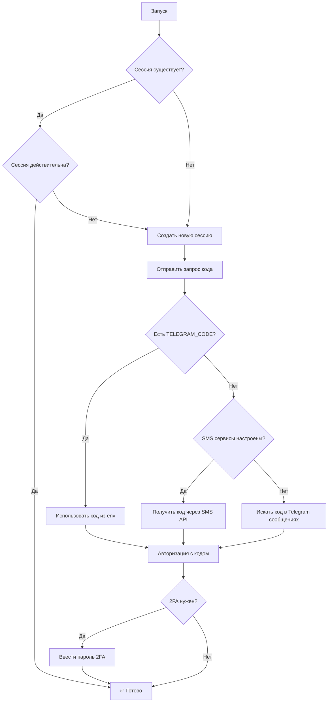

# 🤖 GHOST Telegram Auto Authentication Guide

Автоматическая авторизация в Telegram без ручного ввода кодов.

## 🚀 Быстрый старт

1. **Скопируйте конфигурацию:**
   ```bash
   cp env.example .env
   ```

2. **Заполните обязательные переменные в `.env`:**
   ```env
   TELEGRAM_API_ID=your_api_id_here
   TELEGRAM_API_HASH=your_api_hash_here
   TELEGRAM_PHONE=+1234567890
   ```

3. **Запустите тест:**
   ```bash
   python test_telegram_auto_auth.py
   ```

4. **Запустите систему:**
   ```bash
   python start_telegram_with_auto_auth.py
   ```

## 📱 Методы получения кодов авторизации

Система пробует все доступные методы в порядке приоритета:

### 1. 🔧 Переменная окружения (самый быстрый)
```env
TELEGRAM_CODE=12345
```

### 2. 📞 SMS сервисы (автоматический)
Поддерживаются:
- **5sim.net** (рекомендуется)
- **sms-activate.org**  
- **GetSMS.online**

Пример конфигурации:
```env
SMS_5SIM_API_KEY=your_api_key_here
SMS_COUNTRY_CODE=7
```

### 3. 📨 Поиск в Telegram сообщениях
Автоматически ищет коды в:
- Сообщениях от Telegram (777000)
- Saved Messages
- Других диалогах

## ⚙️ Конфигурация

### Обязательные переменные:
```env
TELEGRAM_API_ID=123456          # Получите на my.telegram.org
TELEGRAM_API_HASH=abcdef123456  # Получите на my.telegram.org  
TELEGRAM_PHONE=+1234567890      # Ваш номер телефона
```

### Дополнительные переменные:
```env
TELEGRAM_CODE=12345             # Код если получили вручную
TELEGRAM_PASSWORD=my2fapass     # Пароль 2FA (если включен)
```

### SMS сервисы:
```env
SMS_5SIM_API_KEY=your_key       # https://5sim.net/
SMS_ACTIVATE_API_KEY=your_key   # https://sms-activate.org/
SMS_GETSMS_API_KEY=your_key     # https://getsms.online/
SMS_COUNTRY_CODE=7              # Код страны (по умолчанию: 7 - Россия)
```

## 🔍 Как работает система



## 🧪 Тестирование

Запустите тест для проверки всех функций:

```bash
python test_telegram_auto_auth.py
```

Тест проверяет:
- ✅ Извлечение кодов из сообщений
- ✅ Методы авторизации
- ✅ Создание авторизованного клиента

## 🔧 Использование в коде

### Базовое использование:
```python
from core.telegram_auto_auth import create_auto_auth_client

# Создать авторизованный клиент
client = await create_auto_auth_client()
```

### Расширенное использование:
```python
from core.telegram_auto_auth import TelegramAutoAuth

# Создать авто-авторизатор
auth = TelegramAutoAuth(api_id, api_hash, phone)

# Проверить существующую сессию
if await auth.validate_session():
    print("Сессия действительна")

# Выполнить автоматическую авторизацию
success = await auth.perform_auth()
```

## ❗ Устранение неполадок

### Проблема: "The key is not registered in the system"
**Решение:** Удалите старые файлы сессии и создайте новую авторизацию:
```bash
rm ghost_session.session*
python test_telegram_auto_auth.py
```

### Проблема: "Не удалось получить код автоматически"
**Решения:**
1. Установите код вручную: `TELEGRAM_CODE=12345`
2. Настройте SMS сервис (рекомендуется 5sim.net)
3. Проверьте права доступа к Telegram аккаунту

### Проблема: "Two-step verification"
**Решение:** Добавьте пароль 2FA:
```env
TELEGRAM_PASSWORD=your_2fa_password
```

### Проблема: "Telegram API credentials invalid"
**Решение:** Проверьте правильность API_ID и API_HASH на https://my.telegram.org/auth

## 🔒 Безопасность

- ❌ **НЕ ПУБЛИКУЙТЕ** `.env` файл в репозитории
- ✅ Используйте переменные окружения на продакшене  
- ✅ SMS API ключи храните в секрете
- ✅ Регулярно обновляйте пароли 2FA

## 📈 Преимущества новой системы

- 🤖 **Полностью автоматическая** авторизация
- 📱 **Множественные методы** получения кодов
- 🔄 **Резервные способы** авторизации
- 🛡️ **Проверка сессий** на валидность
- 📊 **Подробное логирование** процесса
- ⚡ **Быстрая авторизация** при повторных запусках

## 📞 SMS сервисы

### 5sim.net (рекомендуется)
- ✅ Надежный и быстрый
- ✅ Хорошие цены  
- ✅ API документация
- 🌐 Сайт: https://5sim.net/

### sms-activate.org
- ✅ Популярный сервис
- ✅ Много стран
- 🌐 Сайт: https://sms-activate.org/

### GetSMS.online
- ✅ Альтернативный вариант
- 🌐 Сайт: https://getsms.online/

## 🆘 Поддержка

Если возникли проблемы:

1. Запустите тестирование: `python test_telegram_auto_auth.py`
2. Проверьте логи в папке `logs/`
3. Убедитесь что все переменные окружения заполнены
4. Попробуйте разные SMS сервисы

---

**Готово! 🎉 Теперь ваша система Telegram будет авторизоваться автоматически без ручного ввода кодов.**
